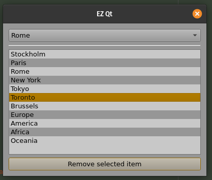
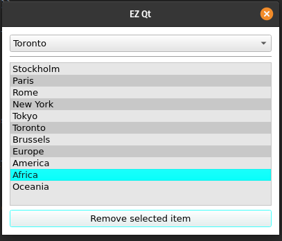

# 🌴 EZ Qt

EZ Qt is a simple collection of helper functions for PySide/PyQt widgets. 

## Installation

`pip install ez-qt`

## Setting themes for your app

You can use `app_colors` to style the colors of your app. The accent colors can be set as either a `QColor`, or you can use `ez_qt.constants.AccentColors`




## Constants

You can use the short notation `k` to use the constants in this package. 

```python
import ez_qt

my_background_color = ez_qt.k.BackgroundColors.dark_gray
```

## Various Examples

```python
import sys
from PySide2.QtWidgets import *
import ez_qt

class Form(QDialog):
    def __init__(self, parent=None):
        super().__init__(parent)
        self.setWindowTitle("EZ Qt")
        self.setMinimumWidth(400)
        self.setMinimumHeight(300)
        self.layout = QVBoxLayout()

        # make a combo box
        self.cb_items = QComboBox()

        # make a list to add to our combo box
        european = ["Stockholm", "Paris", "Rome"]
        ez_qt.combo_box.add_items(self.cb_items, european)

        # let's add some more, but without any duplicates
        entire_world = ["New York", "Tokyo", "Toronto", "Paris", "Brussels"]
        ez_qt.combo_box.add_items(self.cb_items, entire_world, duplicates_allowed=False)

        # let's add the continents as a string
        continents = "Europe, America, Africa, Oceania"
        ez_qt.combo_box.add_items(self.cb_items, continents, string_split_character=",")

        # let's set the combo box to "Toronto"
        ez_qt.combo_box.set_to_item(self.cb_items, "Toronto")

        # let's gather everything in the combo box as a list to use later
        all_geography = ez_qt.combo_box.get_all_items(self.cb_items)

        # adding a list widget
        self.lw_items = QListWidget()

        # Let's add the list we gathered earlier and add it to the list widget
        ez_qt.list_widget.add_items(self.lw_items, items=all_geography)

        # Now let's add a button that removes the selected item from the listwidget
        # It will then also update our combo box to reflect the same update
        self.btn_remove_selected = QPushButton("Remove selected item")
        self.btn_remove_selected.clicked.connect(self.remove_and_update)

        self.layout.addWidget(self.cb_items)
        # adding a horizontal line
        self.layout.addWidget(ez_qt.general.QHLine())
        self.layout.addWidget(self.lw_items)
        self.layout.addWidget(self.btn_remove_selected)

        self.setLayout(self.layout)

    def remove_and_update(self):
        # first remove the selected items
        ez_qt.list_widget.remove_items(self.lw_items, selected=True)

        # then get the remaining items as a list
        listwidget_items = ez_qt.list_widget.get_all_items(self.lw_items)

        # and update the combobox
        ez_qt.combo_box.add_items(self.cb_items, items=listwidget_items, clear=True)

if __name__ == '__main__':
    app = QApplication(sys.argv)
    # set the colors for our app
    # ez_qt.app_colors.set_medium_theme(app, accent_color=ez_qt.k.AccentColors.medium_pink)
    ez_qt.app_colors.set_dark_theme(app, accent_color=ez_qt.k.AccentColors.medium_pink)
    form = Form()
    form.show()
    sys.exit(app.exec_())

```
